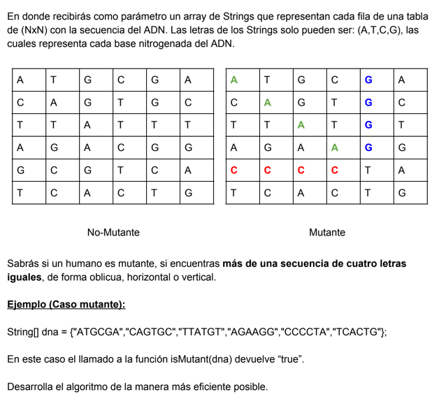
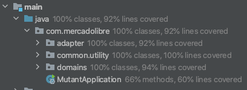
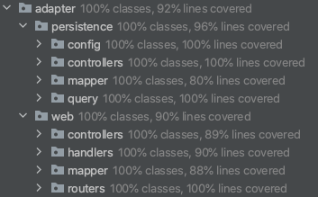
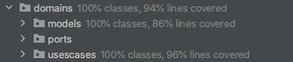
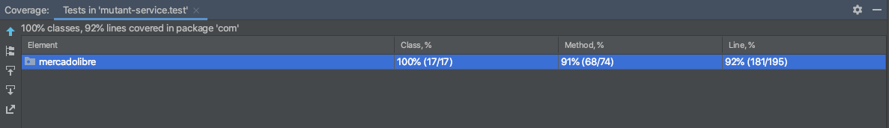

# Ejercicio Mutantes - Mercadolibre


- [Ejercicio](#ejercicio)
    - [Especificaciones](#especificaciones)
    - [Tecnologias](#tecnologias)
    - [Arquitectura](#arquitectura)
- [Setup](#setup)
    - [Instrucciones](#instrucciones)
    - [API Url](#api)
    - [Servicios](#servicios)
        - [Es mutante](#es-mutante)
        - [Estadisticas](#estadisticas)
- [Test](#test)
    - [Cobertura](#cobertura)

## Ejercicio

### Especificaciones

Se desea implementar el hallazgo de mutantes en una Poblacion de acuerdo a su DNA.



### Tecnologias

- [Java11](https://jdk.java.net/11/)
- [Spring](https://spring.io/)
- [Atlas MongoDB](https://www.mongodb.com/cloud/atlas)
- [Project Reactor](https://projectreactor.io/)
- [JUnit5](https://junit.org/junit5/docs/current/user-guide/#overview-getting-started)

### Arquitectura

El estilo de este proyecto es responder a la solucion y necesidad, por tanto su implementacion
sea concebido bajo el marco Clean Architecture, GRASP, SOLID, y recurrir a los patrones de diseño
Adapter y Facade que apalancan las responsabilidades unicas y sostener la alta Cohesion y el Bajo Acoplamiento.



Donde el Adapter es el responsable de Entrar Y Salir de los recursos.



Y asi evitar la complejidad accidental y aumentar lo esencial, dando valor a los dominios que son responsables del core del negocio.



## Setup

### Instrucciones

Para dar marcha a este proyecto debemos tener Java11 y Gradle 6.5.1 (por suerte tenemos Docker :D) para poder asi configurar las dependencias de este.
No debemos precuparnos por la configuracion de Mongo pues este esta Clusteado en Atlas alli este tiene dos bases de datos,
uno para test de las pruebas unitarias y otro para productivo.

1. Clonamos.
2. Ejecutamos```docker-compose up --build``` o ```docker-compose up```.

### API Url

Abrimos nuestro navegador y nos ubicamos en la URL y colocamos 
- POST http://localhost:9730/mutant

Request body (caso ADN mutante):

```
  {"dna":["ATGCGA", "CAGGGC", "TTATGT", "AGAAGG", "CCCCTA", "TCACTG"]}
```

Response:

```
  200 OK
```
Request body (caso ADN humano):

```
  {"dna":["TATAGT", "CAGTGC", "TATAGT", "CTGCGA", "ACACTG", "TCACTG"]}
```

Response:

```
  403 Forbidden
```

#### Estadisticas

Request:
- GET http://localhost:9730/mutant/stats

Response: 200 (application/json)

```
{
    "ratio": 1.0,
    "count_mutant_dna": 1,
    "count_human_dna": 1
}
```

#### Cobertura

